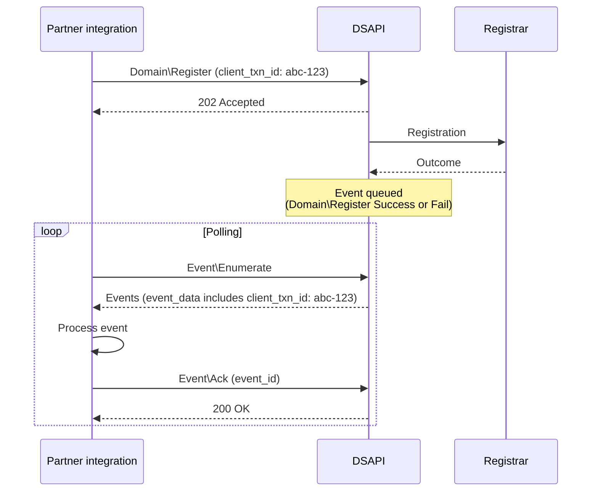

# Domain Services API event reference


The Domain Services API (DSAPI) uses an event-based model to deliver results
from asynchronous commands and domain lifecycle notifications. Events are not
pushed to the partner's system; the partner's integration polls for them using
three commands:

1. **`Event\Enumerate`**: List unacknowledged events, full payloads included (up to 50 per call).
2. **`Event\Details`**: Retrieve a specific event by ID.
3. **`Event\Ack`**: Acknowledge an event after you have processed it.

Events must be acknowledged via `Event\Ack` or they will continue to appear in `Event\Enumerate` results on subsequent calls.

See the [DSAPI command
reference](/docs/api-automation/domain-registration-api/commands/#event-commands) for the
parameters accepted by these commands.

## Poll for events

```
1. Call Event\Enumerate to get a batch of unacknowledged events
2. Process each event in your system
3. Call Event\Ack for each processed event
4. Repeat from step 1 until no events remain
```

The full flow for an async command, from submission to result:



## Event structure

Each event returned by `Event\Enumerate` or `Event\Details` has these fields:

| Field               | Type         | Description                                                                     |
|---------------------|--------------|---------------------------------------------------------------------------------|
| `id`                | int          | Unique event ID. Use it with `Event\Details` and `Event\Ack`.                   |
| `event_class`       | string       | Event type (e.g., `Domain\Register`, `Domain\Notification`).                    |
| `event_subclass`    | string       | Event subtype (e.g., `Success`, `Fail`).                                        |
| `object_type`       | string       | Type of the object the event relates to (`domain` for domain events).           |
| `object_id`         | string       | Identifier of that object; for domain events, the domain name.                  |
| `event_data`        | object       | Event-specific fields, documented in the tables below.                          |
| `event_date`        | string       | Date the event was generated.                                                   |
| `acknowledged_date` | string\|null | Date you acknowledged the event, or `null` if not yet acknowledged.             |

For events produced by async commands, `event_data` also echoes the `client_txn_id` you provided in the originating command, allowing you to correlate the event back to your request.

> **Date format:** All date values in event data are formatted as `YYYY-MM-DD HH:MM:SS` in UTC.

---

## Domain operation results

These events are produced by asynchronous commands (`Domain\Register`, `Domain\Transfer`, `Domain\Renew`, `Domain\Restore`, `Domain\Delete`). Each command produces either a `Success` or `Fail` event.

The `event_data` of every command result event includes these common fields:

| Field                | Type   | Description                                              |
|----------------------|--------|----------------------------------------------------------|
| `client_txn_id`      | string | The correlation ID you sent with the originating command. |
| `status`             | int    | Outcome status code (`200` on success, an [error code](/docs/api-automation/domain-registration-api/overview/#error-codes) on failure). |
| `status_description` | string | Human-readable description of the status code.           |
| `server_txn_id`      | string | Server transaction ID of the originating command.        |

`Fail` events additionally include an `errors` array; each entry has a `description` (the error message) and `extra` (additional structured data, when available). The tables below list only the fields specific to each event type.

### `Domain\Register\Success`

Registration completed successfully.

| Field                               | Type   | Description                                         |
|-------------------------------------|--------|-----------------------------------------------------|
| `agp_end_date`                      | string | End date of the Add Grace Period.                   |
| `domain_status`                     | array  | Array of EPP status codes for the domain.           |
| `expiration_date`                   | string | Domain expiration date.                             |
| `renewable_until`                   | string | Last date the domain can be renewed.                |
| `unverified_contact_suspension_date`| string | Date by which contacts must be verified to avoid suspension. |
| `contacts`                          | object | Contact information set on the domain.              |
| `transferlocked_until_date`         | string | Date until which the domain is transfer-locked.     |

**Related command:** [`Domain\Register`](/docs/api-automation/domain-registration-api/commands/#domainregister)

---

### `Domain\Register\Fail`

Registration failed.

Contains the [common failure fields](#domain-operation-results) only; the error message is in `errors[0].description`.

**Related command:** [`Domain\Register`](/docs/api-automation/domain-registration-api/commands/#domainregister)

---

### `Domain\Renew\Success`

Renewal completed successfully.

| Field              | Type   | Description                               |
|--------------------|--------|-------------------------------------------|
| `domain_status`    | array  | Array of EPP status codes for the domain. |
| `expiration_date`  | string | Updated domain expiration date.           |
| `renewable_until`  | string | Updated last date the domain can be renewed. |

**Related command:** [`Domain\Renew`](/docs/api-automation/domain-registration-api/commands/#domainrenew)

---

### `Domain\Renew\Fail`

Renewal failed.

Contains the [common failure fields](#domain-operation-results) only; the error message is in `errors[0].description`.

**Related command:** [`Domain\Renew`](/docs/api-automation/domain-registration-api/commands/#domainrenew)

---

### `Domain\Restore\Success`

Domain restored from redemption successfully.

| Field              | Type   | Description                               |
|--------------------|--------|-------------------------------------------|
| `domain_status`    | array  | Array of EPP status codes for the domain. |
| `expiration_date`  | string | Updated domain expiration date.           |
| `renewable_until`  | string | Updated last date the domain can be renewed. |

**Related command:** [`Domain\Restore`](/docs/api-automation/domain-registration-api/commands/#domainrestore)

---

### `Domain\Restore\Fail`

Restore failed.

Contains the [common failure fields](#domain-operation-results) only; the error message is in `errors[0].description`.

**Related command:** [`Domain\Restore`](/docs/api-automation/domain-registration-api/commands/#domainrestore)

---

### `Domain\Delete\Success`

Domain deleted successfully. No event-specific fields beyond the common fields; the domain name is in the event's `object_id`.

**Related command:** [`Domain\Delete`](/docs/api-automation/domain-registration-api/commands/#domaindelete)

---

### `Domain\Delete\Fail`

Deletion failed.

Contains the [common failure fields](#domain-operation-results) only; the error message is in `errors[0].description`.

**Related command:** [`Domain\Delete`](/docs/api-automation/domain-registration-api/commands/#domaindelete)

---

### `Domain\Transfer\Success`

Transfer command accepted by the registry. No event-specific fields beyond the common fields; the domain name is in the event's `object_id`.

> **Note:** This event confirms the transfer command was accepted, not that the transfer is complete. See [Transfer Events](#transfer-events) below for the full transfer lifecycle.

**Related command:** [`Domain\Transfer`](/docs/api-automation/domain-registration-api/commands/#domaintransfer)

---

### `Domain\Transfer\Fail`

Transfer command failed.

Contains the [common failure fields](#domain-operation-results) only; the error message is in `errors[0].description`.

**Related command:** [`Domain\Transfer`](/docs/api-automation/domain-registration-api/commands/#domaintransfer)

---

## Transfer events

Transfer events track the full lifecycle of domain transfers, both inbound and outbound. All transfer events share a common set of base fields:

| Field                  | Type   | Description                                            |
|------------------------|--------|--------------------------------------------------------|
| `request_date`         | string | Date the transfer was requested.                       |
| `execute_date`         | string | Date the transfer is scheduled to execute.             |
| `transfer_status`      | string | Current status of the transfer.                        |

### `Domain\Transfer\In\Pending`

An inbound transfer has been accepted by the losing registrar and is pending completion.

**Additional fields:** None (base transfer fields only).

---

### `Domain\Transfer\In\Completed`

An inbound transfer has completed. The domain is now under your management.

| Field                       | Type   | Description                                     |
|-----------------------------|--------|-------------------------------------------------|
| `transferlocked_until_date` | string | Date until which the domain is transfer-locked. |

---

### `Domain\Transfer\In\Rejected`

An inbound transfer was rejected by the losing registrar or the domain owner.

**Additional fields:** None (base transfer fields only).

---

### `Domain\Transfer\Out\Pending`

An outbound transfer has been initiated by another registrar.

**Additional fields:** None (base transfer fields only).

---

### `Domain\Transfer\Out\Completed`

An outbound transfer has completed. The domain has left your management.

**Additional fields:** None (base transfer fields only).

---

### `Domain\Transfer\Out\Rejected`

An outbound transfer was rejected.

**Additional fields:** None (base transfer fields only).

---

## Domain notifications

Domain notifications report lifecycle changes that occur outside direct
commands. See [Registrant contact
verification](/docs/api-automation/domain-registration-api/domain-lifecycle/#registrant-contact-verification)
for the verification and suspension flow.

### `Domain\Notification\Verification_Request`

Contact verification is required. The domain owner must verify their contact information.

| Field               | Type   | Description                                  |
|---------------------|--------|----------------------------------------------|
| `email`             | string | The email address that must be verified.     |
| `verification_code` | string | The verification code for the contact. Treat this value as sensitive. |

---

### `Domain\Notification\Verification_Success`

A contact verification has been completed successfully.

| Field  | Type   | Description             |
|--------|--------|-------------------------|
| `info` | string | Informational message.  |

---

### `Domain\Notification\Verified`

The domain has been verified.

| Field  | Type   | Description             |
|--------|--------|-------------------------|
| `info` | string | Informational message.  |

---

### `Domain\Notification\Suspended`

The domain has been suspended due to an unverified contact.

| Field  | Type   | Description             |
|--------|--------|-------------------------|
| `info` | string | Informational message.  |

---

### `Domain\Notification\Unsuspended`

The domain has been unsuspended.

| Field  | Type   | Description             |
|--------|--------|-------------------------|
| `info` | string | Informational message.  |

---

### `Domain\Notification\Argp`

The domain has entered the Auto-Renew Grace Period (ARGP). During this period, the domain can still be renewed at standard pricing.

| Field           | Type   | Description                          |
|-----------------|--------|--------------------------------------|
| `argp_end_date` | string | Date the ARGP ends.                  |

---

### `Domain\Notification\Redemption`

The domain has entered the redemption period. Restoring the domain during this period requires a restore command and may incur additional fees.

| Field                | Type   | Description                             |
|----------------------|--------|-----------------------------------------|
| `redemption_end_date`| string | Date the redemption period ends.        |

---

### `Domain\Notification\Pending_Delete`

The domain has entered the pending delete phase. It can no longer be restored and will be released for general registration.

| Field                    | Type   | Description                                |
|--------------------------|--------|--------------------------------------------|
| `pending_delete_end_date`| string | Date the pending delete period ends.       |

---

### `Domain\Notification\Auction`

The domain is in an expiry auction.

| Field                    | Type   | Description                                                        |
|--------------------------|--------|--------------------------------------------------------------------|
| `auction_status`         | string | Auction status: `PARKED`, `SUBMITTED`, or `ACTIVE`.                |
| `auction_status_end_date`| string | Date the current auction status phase ends.                        |

---

## System events

System events are not tied to a specific domain.

### `Domain\Maintenance`

A system maintenance window is scheduled. During maintenance, some operations on affected TLDs or registries may be unavailable.

| Field     | Type   | Description                                                                                                     |
|-----------|--------|-----------------------------------------------------------------------------------------------------------------|
| `start`   | string | Maintenance window start time.                                                                                  |
| `end`     | string | Maintenance window end time.                                                                                    |
| `scope`   | object | Structured object describing what is affected. Keys: `tld`, `registry`, `backend`, `registrar`.                 |
| `comment` | string | Human-readable description of the maintenance.                                                                  |
