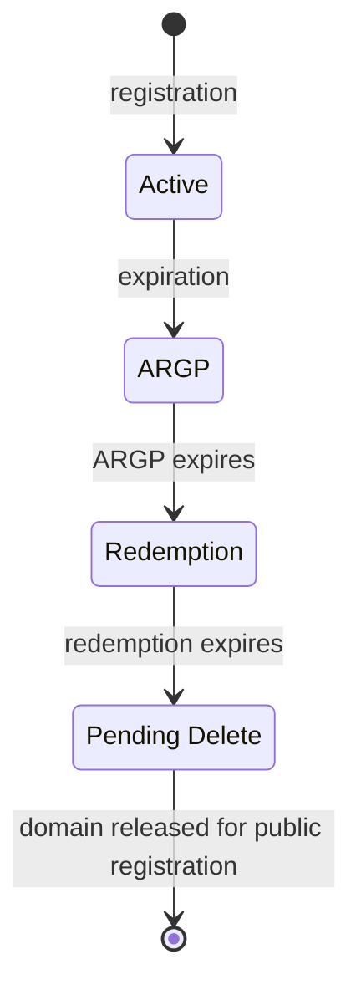

# Domain lifecycle

This guide describes the lifecycle of a domain managed through the Domain
Services API (DSAPI). It covers domain statuses, state transitions, and the
flows for registration, renewal, expiration, restoration, transfer, and
deletion.

All date values in events and responses are formatted as `YYYY-MM-DD HH:MM:SS` in UTC.

---

## Domain statuses

| Status               | Description                                                                 |
|----------------------|-----------------------------------------------------------------------------|
| Active               | Domain is registered and operational.                                       |
| ARGP                 | Auto-Renew Grace Period: domain can be renewed at the normal price. Typically 43 days, but varies by TLD. |
| Redemption           | Domain can be restored for a premium fee. Duration is TLD-dependent.        |
| Pending Delete       | Final period before the domain is released for public registration. Typically 5 days. |
| Transfer Out Pending | An outbound transfer to another registrar is in progress.                   |

---

## Expiration flow

The regular flow of a domain that expires and is never renewed:

At every stage before Pending Delete the domain can return to **Active**: by renewal during ARGP, or by restore during Redemption. The complete set of transitions, including transfers and TLDs without ARGP or redemption support, is in the table below.

### Transition summary

| From                 | To                   | Trigger                                          |
|----------------------|----------------------|--------------------------------------------------|
| (none)               | Active               | Registration or inbound transfer completes        |
| Active               | ARGP                 | Domain expires, TLD supports ARGP                 |
| Active               | Pending Delete       | Domain expires, TLD does not support ARGP         |
| Active               | Transfer Out Pending | Another registrar initiates a transfer            |
| ARGP                 | Active               | Domain is renewed during ARGP                     |
| ARGP                 | Redemption           | ARGP expires, TLD supports redemption             |
| ARGP                 | Pending Delete       | ARGP expires, TLD does not support redemption     |
| Redemption           | Active               | Domain is restored                                |
| Redemption           | Pending Delete       | Redemption period expires                         |
| Pending Delete       | Removed              | Pending delete period ends, domain released        |
| Transfer Out Pending | Active               | Transfer is rejected                              |
| Transfer Out Pending | Removed              | Transfer completes, domain leaves your management |

---

## Lifecycle flows

### Registration

The partner's integration sends a `Domain\Register` command. The API returns
HTTP 202 Accepted immediately.

**On success:** A `Domain\Register\Success` event is delivered containing:
- `agp_end_date`: end of the Add Grace Period
- `expiration_date`: domain expiration date
- `transferlocked_until_date`: date until which the domain is transfer-locked

The domain starts in **Active** status.

**On failure:** A `Domain\Register\Fail` event is delivered. The error message is at `errors[0].description` in the event data.

See [`Domain\Register` command](/docs/api-automation/domain-registration-api/commands/#domainregister) and [`Domain\Register\Success` event](/docs/api-automation/domain-registration-api/events/#domainregistersuccess) for full parameter and field details.

---

### Renewal

The partner's integration sends a `Domain\Renew` command with the
`current_expiration_year` parameter to prevent double renewals. The API returns
HTTP 202 Accepted.

**On success:** A `Domain\Renew\Success` event is delivered with the updated `expiration_date`.

**On failure:** A `Domain\Renew\Fail` event is delivered with the error message at `errors[0].description`.

**Renewal reminder emails** are sent at:
- 30 days before expiry
- 5 days before expiry
- 3 days after expiry

See [`Domain\Renew` command](/docs/api-automation/domain-registration-api/commands/#domainrenew) and [`Domain\Renew\Success` event](/docs/api-automation/domain-registration-api/events/#domainrenewsuccess).

---

### Expiration

When a domain expires without renewal, DNS is disrupted: nameservers are changed and DNS records may be removed.

The next status depends on TLD support:

**If the TLD supports ARGP:**
- Status changes to **ARGP**.
- A `Domain\Notification\Argp` event is delivered with `argp_end_date`.
- The domain can still be renewed at the normal price during this period.

**If the TLD does not support ARGP:**
- Status changes to **Pending Delete**.
- A `Domain\Notification\Pending_Delete` event is delivered with `pending_delete_end_date`.

**If ARGP expires without renewal:**
- If the TLD supports redemption: status changes to **Redemption**, and a `Domain\Notification\Redemption` event is delivered with `redemption_end_date`.
- If the TLD does not support redemption: status changes to **Pending Delete**, and a `Domain\Notification\Pending_Delete` event is delivered.

See [Domain Notifications](/docs/api-automation/domain-registration-api/events/#domain-notifications) for event field details.

---

### Restore (from Redemption)

When a domain is in Redemption status, the partner's integration can send a
`Domain\Restore` command. The API returns HTTP 202 Accepted.

**On success:** A `Domain\Restore\Success` event is delivered. The domain returns to **Active** status with an updated `expiration_date`.

**On failure:** A `Domain\Restore\Fail` event is delivered with the error message at `errors[0].description`.

Restoring a domain typically incurs a premium fee charged by the registry, in addition to any renewal fees.

See [`Domain\Restore` command](/docs/api-automation/domain-registration-api/commands/#domainrestore) and [`Domain\Restore\Success` event](/docs/api-automation/domain-registration-api/events/#domainrestoresuccess).

---

### Transfer in

To transfer a domain from another registrar, the partner's integration sends a
`Domain\Transfer` command with the domain's `auth_code`. The API returns HTTP
202 Accepted.

The transfer proceeds through these stages:

1. **Pending:** A `Domain\Transfer\In\Pending` event is delivered when the losing registrar accepts the transfer request.
2. **Completed:** A `Domain\Transfer\In\Completed` event is delivered on success. The domain is now **Active** and the [60-day transfer lock](/docs/api-automation/domain-registration-api/overview/#the-60-day-transfer-lock) applies (the `transferlocked_until_date` field indicates when it expires).
3. **Rejected:** A `Domain\Transfer\In\Rejected` event is delivered if the losing registrar or domain owner rejects the transfer.

See [`Domain\Transfer` command](/docs/api-automation/domain-registration-api/commands/#domaintransfer) and [Transfer Events](/docs/api-automation/domain-registration-api/events/#transfer-events).

---

### Transfer out

Outbound transfers are initiated externally: another registrar requests the domain on behalf of the domain owner. DSAPI notifies you via events:

1. **Pending:** A `Domain\Transfer\Out\Pending` event is delivered. The domain status changes to **Transfer Out Pending**.
2. **Completed:** A `Domain\Transfer\Out\Completed` event is delivered. The domain has left your management and is removed from DSAPI.
3. **Rejected:** A `Domain\Transfer\Out\Rejected` event is delivered. The domain returns to **Active** status.

See [Transfer Events](/docs/api-automation/domain-registration-api/events/#transfer-events).

---

### Delete

The partner's integration sends a `Domain\Delete` command. The API returns
HTTP 202 Accepted.

**On success:** A `Domain\Delete\Success` event is delivered. The domain transitions to **Redemption** or **Pending Delete** depending on TLD support.

**On failure:** A `Domain\Delete\Fail` event is delivered with the error message at `errors[0].description`.

See [`Domain\Delete` command](/docs/api-automation/domain-registration-api/commands/#domaindelete) and [`Domain\Delete\Success` event](/docs/api-automation/domain-registration-api/events/#domaindeletesuccess).

---

### Registrant contact verification

ICANN requires the registrar to verify the registrant's email address. Verification is triggered when a domain is registered, transferred in, or when the registrant's email address changes.

**If the address is already trusted** (for example, it was previously verified for another domain), the domain is verified automatically and no verification email is sent.

**Otherwise, the verification process starts:**

1. A verification email with a confirmation link is sent to the registrant, and a `Domain\Notification\Verification_Request` event is delivered with the `email` and `verification_code`.
2. The registrant must complete the verification within **15 days**. The deadline is reported in the `unverified_contact_suspension_date` field of the `Domain\Register\Success` event and of `Domain\Info`.
3. When the registrant confirms, `Domain\Notification\Verification_Success` and `Domain\Notification\Verified` events are delivered.
4. If the deadline passes without verification, the domain is **suspended**: its nameservers are replaced with suspension nameservers and the domain stops resolving. A `Domain\Notification\Suspended` event is delivered and the registrant is notified by email.
5. A suspended domain is restored as soon as the registrant completes the verification, and a `Domain\Notification\Unsuspended` event is delivered.

The verification email can be re-sent at any time with the [`Email\Send\Verification`](/docs/api-automation/domain-registration-api/commands/#emailsendverification) command.

See [Domain Notifications](/docs/api-automation/domain-registration-api/events/#domain-notifications) for the event field details.

---

## Example .com timeline

The following timeline illustrates the full lifecycle of a .COM domain from registration through release:

| Day   | Event                                           | Status         |
|-------|--------------------------------------------------|----------------|
| 0     | Domain registered                                | Active         |
| 335   | Renewal reminder email sent (30 days before expiry) | Active      |
| 360   | Last chance email sent (5 days before expiry)    | Active         |
| 365   | Domain expires, DNS disrupted                    | ARGP           |
| 368   | Urgent renewal email sent (3 days after expiry)  | ARGP           |
| 365-408 | ARGP (43 days): can renew at normal price   | ARGP           |
| 408   | ARGP ends                                        | Redemption     |
| 408-438 | Redemption (~30 days): can restore at premium fee | Redemption |
| 438   | Redemption ends                                  | Pending Delete |
| 438-443 | Pending Delete (5 days)                        | Pending Delete |
| 443+  | Domain released for public registration          | Removed        |

> **Note:** Durations vary by TLD. Not all TLDs support ARGP or redemption. Use `Domain\Info` to check the current status and dates for a specific domain.

---
